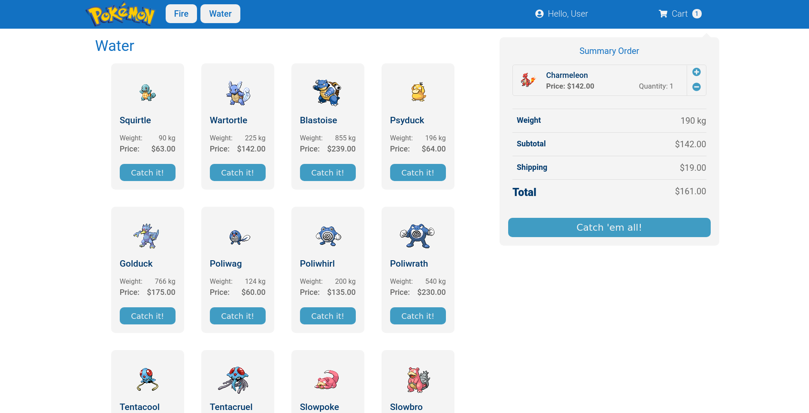

# Pokemon Store

- [Pokemon Store](#pokemon-store)
  - [Overview](#overview)
  - [Technologies](#technologies)
  - [Development](#development)
    - [Heroku Deploy](#heroku-deploy)
  - [Goals](#goals)
  - [Prototype](#prototype)
  - [Results](#results)
    - [Desktop](#desktop)
    - [Mobile](#mobile)
  - [License](#license)
  - [References](#references)

:rocket: A demo of ***Pokemon Store*** is available [**here**]().

<!-- gif -->

## Overview

***Pokemon Store*** is a project with two stores for two types of Pokémon using the ReacJS framework.

The store is presented according to the type of Pokémon. There are [18-type Pokémon](https://bulbapedia.bulbagarden.net/wiki/Type), but the store only has two types: [Fire](https://bulbapedia.bulbagarden.net/wiki/Fire_(type)) and [Water](https://bulbapedia.bulbagarden.net/wiki/Water_(type)).

This project is organized into the following **components**:

* Cart
  * In this component, the detailed summary of the purchased items was presented. 
    * Each purchased item presented:
      * Image,
      * Name,
      * Price = Price x Quantity,
      * Quantity, and
      * Option to add or remove items.
    * Total Weight (Sum of total weight),
    * Subtotal (Sum of the total price of the items),
    * Shipping ($0.1 per kilogram),
    * Total (Subtotal + Shipping), and
    * Finish shopping (Catch 'em all!).
* Footer
  * In this component, you can see developer info.
* Header
  * In this component, the navigation bar on the left was defined to change between the types of Pokémon:
    * In the **Fire Button**, you can see the complete list of fire-type Pokemon. 
    * In the **Water Button**, you can see the full list of water-type Pokemon.
  * Also, the number of items purchased was defined on the right.
    * In the **Cart Button**, you can show or hide the detailed summary of the purchased items.
* ProductsGrid
  * In this component, each item of the list of Pokémon was presented.
  * Each item has the following features:
    * Image,
    * Name,
    * Weight [kg],
    * Price based on its *base_experience*, and
    * Button for add to cart (Catch it!).
* Styling
  * In this component, the color palette was defined for each store, maintaining the same behavior. 


## Technologies

* The project was developed using the framework [ReactJS](https://reactjs.org/).
* CSS was used for the basic styling of the navbar, forms, and other components.
* [react-icons](https://react-icons.github.io/) was used for complementary styling, and to have a better user experience, [react-infinite-scroller](https://www.npmjs.com/package/react-infinite-scroller) was used to load content.
* The RESTful Pokemon API [PokéAPI](https://pokeapi.co/) was used to request the Pokémon.
* [Axios](https://github.com/axios/axios) was used to promise-based HTTP client.
* Finally, [Heroku](www.heroku.com) was used to deploy the project.


## Development 

```shell
# 1. Check if it is installed
node -v
npm -v

# 2. Clone the project
git clone git@github.com:mafda/pokemon_store.git

# 2.1. Go to the project directory
cd pokemon_store/frontend

# 3. Install the project dependencies
npm install

# 5. Run the server
npm start

# 6. Enjoy it!
echo "well done! :)"
```

Done! Now navigate to http://localhost:3000/

### Heroku Deploy 

```shell
# 1. Create the app on Heroku 
heroku create awesome-pokemon-store

# 2. Deploy it :)
git subtree push --prefix frontend heroku master

heroku create -b https://github.com/mars/create-react-app-buildpack.git

# 3. Enjoy it!
echo "well done! :)"
```

Done! Now navigate to https://awesome-pokemon-store.herokuapp.com/

> The application link will depend on the application name registered on Heroku.

## Goals

The MVP (Minimum Viable Product) consists of:

* [x] Product catalog.
* [x] Side cart.
* [x] Cart summary.
* [x] 2 stores with different styles and types of Pokémon.

Bonus features:

* [ ] Search bar to filter Pokémon.
* [ ] Checkout button, restarting the purchase process.
* [ ] Modal thanks to checkout.
* [ ] Save user purchase data locally so as not to lose it when refreshing the page.

## Prototype

* HTML/CSS only
  * :file_folder: [Sketch](https://github.com/mafda/pokemon_store/tree/master/sketch) 
  * :computer: [CodePen](https://codepen.io/mafda/pen/oNbmpWx) 


## Results

### Desktop


### Mobile

## License

[](https://opensource.org/licenses/MIT)

## References

* Logo [Pokémon](https://logodownload.org/pokemon-logo/).

---

**</>** with 💙 by [mafda](https://mafda.github.io/).
